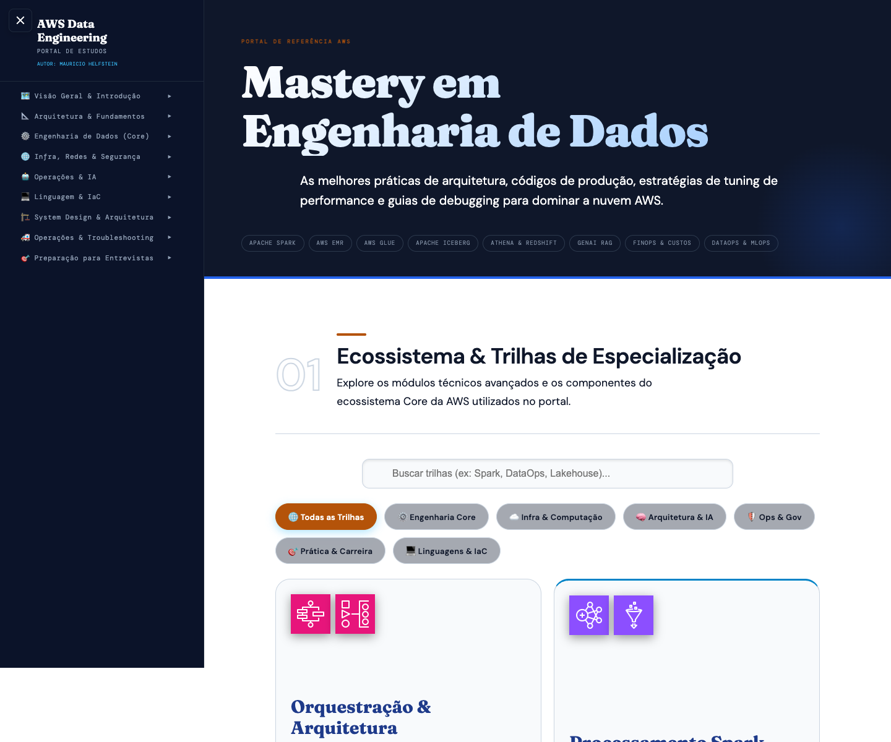

# AWS Data Mastery



Este é o **Portal de Estudos AWS Data Engineering Specialist**, o guia definitivo de arquiteturas, boas práticas e tuning para engenharia de dados na AWS.
Este portal é 100% Client-Side Renderizado (CSR) usando apenas HTML, CSS e JavaScript puros (Vanilla), com dependência zero de backends pesados.

🌐 **Acesse o portal online:** [https://helfstein-one.github.io/aws-data-mastery/](https://helfstein-one.github.io/aws-data-mastery/)

## 🚀 Como Executar Localmente

### 1. Clonando o repositório
```bash
git clone https://github.com/Helfstein-one/aws-data-mastery.git
cd aws-data-mastery
```

### 2. Rodando o Servidor Local
Por ser uma página puramente baseada em HTML/CSS/JS (Vanilla), você pode hospedar o projeto em qualquer web-server estático. O método mais fácil no Mac/Linux (que tenha Python) é:

```bash
python3 -m http.server 8000
```
Isso iniciará um servidor local.

### 3. Acessando o Portal
Abra o navegador e acesse:
[http://localhost:8000](http://localhost:8000)

## 🧩 Arquitetura

- **Client-Side Storage**: O portal utiliza o `localStorage` do navegador para rastrear sua jornada e atualizar a barra de progresso.
- **Draw.io Integrado**: Os diagramas do portal usam o viewer `data-mxgraph` da biblioteca mxGraph (Draw.io). Os diagramas já estão injetados no código fonte das páginas, dispensando carregamentos pesados.
- **Estrutura de Pastas**:
  - `/pages`: Onde todo o conteúdo por domínio se encontra (Engenharia, Arquitetura, Fundamentos, Prática).
  - `/css` e `/js`: Estilos e controle de interatividade do portal.
  - `/assets`: Ícones e imagens globais.

## 🤝 Contribuições

Contribuições são super bem-vindas. Sinta-se à vontade para fazer um Pull Request para adicionar dicas, comandos úteis ou casos de uso!
