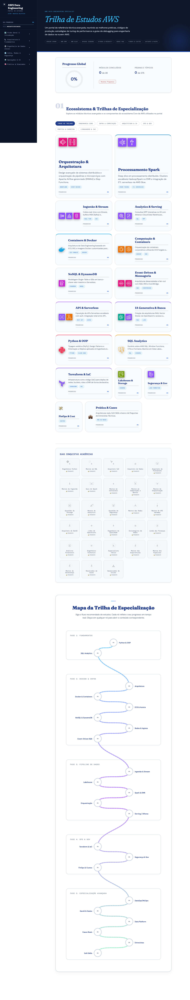

# 🗺️ AWS Data Engineering Specialist - Portal de Estudos

Bem-vindo ao **AWS Data Mastery**, um portal de referência técnica avançada, projetado especificamente para Engenheiros de Dados que buscam a especialização em arquitetura de dados escalável, resiliente e de custo-eficiente na nuvem AWS.

Este repositório contém a base de código e os conteúdos práticos do portal, organizados em trilhas interativas de estudo com cálculo de progresso automatizado localmente (via LocalStorage) e gamificação por meio de conquistas e medalhas.

---

## 🚀 O que você encontrará no Portal?

O portal está estruturado para cobrir do design abstrato de sistemas distribuídos até o tuning de baixo nível de engines de execução:

### 1. 📐 Arquitetura & Padrões
- Design de Sistemas Distribuídos e os 7 Pilares de Dados.
- Padrões de arquitetura Lambda e Kappa em cenários de alta vazão.
- Implementações reais de Data Mesh e Lakehouses transacionais.

### 2. ⚡ Ingestão, Processamento & Analytics
- Ingestão contínua com Kinesis e CDC com AWS DMS.
- Tuning de performance do Apache Spark em AWS Glue e EMR Serverless.
- Consultas de altíssima performance no Athena e Redshift Serverless.

### 3. 🤖 Inteligência Artificial & GenAI
- Roteamento e orquestração de RAG (Retrieval-Augmented Generation) com Amazon Bedrock.
- Bancos de dados vetoriais (pgvector) e Prompt Engineering voltado a pipelines de dados.

### 4. ⚙️ Operações, Segurança & FinOps
- Práticas de DataOps & MLOps com pipelines de CI/CD baseados em Gitflow.
- Governança refinada e segurança com AWS Lake Formation, IAM, KMS e Secrets Manager.
- Práticas financeiras agressivas de FinOps para controle e corte de custos de processamento.

---

## 🤝 Solução Colaborativa: Contribua!

Este portal é uma **iniciativa colaborativa e viva**. Se você identificou um bug, tem uma sugestão de arquitetura ou quer propor um novo tema técnico de Engenharia de Dados na AWS, a sua contribuição é super bem-vinda!

### Como Contribuir:

1. **Abra uma Issue:**
   - Para propor novos temas ou sugerir novos conteúdos práticos, utilize o template de [💡 Sugestão de Conteúdo](https://github.com/Helfstein-one/aws-data-mastery/issues/new?template=sugestao_conteudo.md).
   - Para reportar erros de digitação, bugs de código ou layout no portal, utilize o template de [🐛 Relato de Bug](https://github.com/Helfstein-one/aws-data-mastery/issues/new?template=relato_bug.md).

2. **Envie um Pull Request:**
   - Faça um fork do repositório.
   - Crie uma branch com a sua modificação (`git checkout -b feature/novo-tema`).
   - Faça o commit das suas alterações (`git commit -m 'feat: adiciona bloco de tuning de join no spark'`).
   - Abra um Pull Request direcionado à branch principal.

> [!NOTE]
> Certifique-se de que os issues e PRs seguem uma linguagem clara e detalhada para facilitar a revisão pela comunidade.

---

## 🛠️ Tecnologias Utilizadas
- **Estruturação:** HTML5 Semântico.
- **Estilização:** CSS Vanilla com variáveis CSS dinâmicas (Dark Mode e Glassmorphism).
- **Lógica e Gamificação:** JavaScript puro (ES6) integrado ao LocalStorage para manter o progresso do estudante.

---
*Desenvolvido com foco na excelência técnica e na evolução contínua da comunidade de Engenharia de Dados.*

## 📸 Preview do Portal

## Atualizações Recentes (v1.7.1)

- 🩺 **Playbook de Crises Refatorado**: Padronização e adição de Matrizes de Comunicação Executiva para todas as crises, garantindo uma resposta padronizada para stakeholders técnicos e de negócio.
- 🗣️ **Comunicação e Liderança**: O template RFO (Reason For Outage) agora possui seu local dedicado no hub de Soft Skills do portal.
- 📦 **Novo Layout Bento Box & Gamificação**: Nova interface moderna consolidando as Trilhas de Especialização em formato de grade (Bento Grid) com *Badges de Conquistas* integradas nativamente.
- 🎨 **Interface Dark Mode & AWS 2026**: Aprimoramento da iconografia oficial nos diagramas de Arquitetura.

Veja o histórico de atualizações completo no [CHANGELOG.md](CHANGELOG.md).

